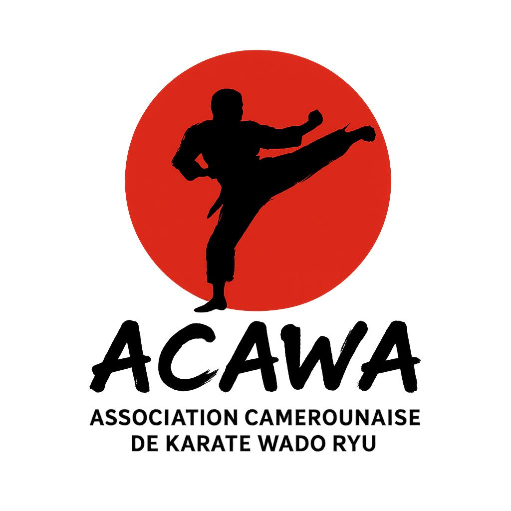

# ACAWA - Association Camerounaise de Karaté Wadokai



**L'Art Martial de l'Excellence** - Plateforme web officielle de l'Association Camerounaise de Karaté Wadokai

[](https://github.com/momogodi2000/Acawa-officail-web-site)
[](LICENSE)
[](https://web.dev/progressive-web-apps/)
[](https://www.typescriptlang.org/)

## 🥋 À Propos

ACAWA est l'Association Camerounaise de Karaté Wadokai, dédiée à la promotion et au développement de l'art martial traditionnel du Karaté Wadokai au Cameroun. Notre plateforme web moderne offre une expérience immersive pour découvrir nos clubs, nos maîtres, nos événements et rejoindre notre communauté.

### ✨ Caractéristiques Principales

- **🌐 Progressive Web App (PWA)** - Installation sur mobile et desktop
- **📱 Design Responsive** - Optimisé pour tous les appareils
- **🎨 Interface Moderne** - UI/UX élégante avec Tailwind CSS
- **🚀 Performance Optimisée** - Lazy loading et mise en cache intelligente
- **🌍 Multilingue** - Support Français/Anglais
- **♿ Accessible** - Conforme aux standards WCAG
- **🔒 Sécurisé** - HTTPS et bonnes pratiques de sécurité

## 🛠️ Technologies Utilisées

### Frontend
- **React 18** - Bibliothèque UI moderne avec hooks
- **TypeScript** - Typage statique pour plus de robustesse
- **Vite** - Bundler ultra-rapide pour le développement
- **React Router Dom** - Navigation côté client
- **Tailwind CSS** - Framework CSS utility-first

### Performance & PWA
- **React Helmet Async** - Gestion du SEO et meta tags
- **Service Workers** - Mise en cache et fonctionnement offline
- **Web App Manifest** - Configuration PWA
- **Lazy Loading** - Chargement optimisé des composants

### Développement
- **ESLint** - Analyse statique du code
- **Prettier** - Formatage automatique
- **Husky** - Git hooks pour la qualité
- **Jest** - Tests unitaires et d'intégration

## 🚀 Installation & Lancement

### Prérequis
- Node.js 16+ 
- npm ou yarn
- Git

### Installation
```bash
# Cloner le repository
git clone https://github.com/momogodi2000/Acawa-officail-web-site.git
cd Acawa-officail-web-site

# Installer les dépendances
npm install

# Lancer en mode développement
npm run dev

# Construire pour la production
npm run build

# Prévisualiser la build de production
npm run preview
```

## 📁 Structure du Projet

```
src/
├── components/          # Composants réutilisables
│   ├── layout/         # Header, Footer, Navigation
│   └── ui/             # Composants UI (Buttons, Modals, etc.)
├── contexts/           # Contexts React (Theme, Language)
├── controllers/        # Logique métier
├── hooks/              # Hooks personnalisés
├── models/             # Types et interfaces TypeScript
├── pages/              # Pages de l'application
├── services/           # Services API et externes
├── styles/             # Styles globaux
└── utils/              # Utilitaires et helpers

public/
├── icons/              # Icônes et logos PWA
├── images/             # Images et médias
├── manifest.json       # Manifeste PWA
└── sw.js              # Service Worker
```

## 🏗️ Architecture

### Composants Principaux

#### Pages
- **HomePage** - Page d'accueil avec hero et présentation
- **AboutPage** - Histoire d'ACAWA et présentation des maîtres
- **ClubsPage** - Liste des clubs et dojos affiliés
- **ChampionsPage** - Nos champions et leurs exploits
- **EventsPage** - Événements, stages et compétitions
- **GalleryPage** - Galerie photos des événements
- **ContactPage** - Formulaire de contact et informations

#### Fonctionnalités
- **PWA Support** - Installation et utilisation offline
- **Responsive Design** - Adaptatif mobile/tablet/desktop
- **SEO Optimized** - Meta tags dynamiques et sitemap
- **Performance** - Code splitting et lazy loading

## 🎨 Design System

### Palette de Couleurs
- **Primaire** : Rouge (#DC2626) - Passion et force
- **Secondaire** : Jaune (#EAB308) - Énergie et sagesse
- **Accent** : Vert (#16A34A) - Harmonie et équilibre
- **Neutre** : Gris (#64748B) - Stabilité et professionnalisme

### Typographie
- **Titres** : Inter, système sans-serif
- **Corps** : Inter, système sans-serif
- **Échelle** : 12px → 14px → 16px → 20px → 24px → 32px → 48px

## 📱 PWA Features

### Installation
L'application peut être installée sur :
- **iOS** : Safari > Partager > Ajouter à l'écran d'accueil
- **Android** : Chrome > Menu > Installer l'application
- **Desktop** : Chrome > Menu > Installer ACAWA...

### Fonctionnalités Offline
- Pages principales en cache
- Fonctionnement sans connexion
- Synchronisation automatique
- Notifications push (à venir)

## 🌍 Internationalisation

Support multilingue avec context React :
- **Français** (par défaut) - Langue principale
- **Anglais** - Pour l'international
- Changement dynamique sans rechargement
- URLs localisées

## 🔧 Configuration

### Variables d'Environnement
```env
VITE_APP_NAME=ACAWA
VITE_APP_VERSION=1.0.0
VITE_API_URL=https://api.acawa-cameroon.org
VITE_CONTACT_EMAIL=contact@acawa-cameroon.org
VITE_CONTACT_PHONE=+237675395238
```

### Service Worker
Configuration dans `public/sw.js` :
- Cache des ressources statiques
- Stratégie cache-first pour les images
- Network-first pour l'API
- Nettoyage automatique des anciens caches

## 🧪 Tests

```bash
# Tests unitaires
npm run test

# Tests en mode watch
npm run test:watch

# Couverture de code
npm run test:coverage
```

Structure de tests :
```
src/
├── __tests__/          # Tests unitaires
├── components/
│   └── __tests__/      # Tests de composants
└── pages/
    └── __tests__/      # Tests de pages
```

## 📈 Performance

### Optimisations Implémentées
- **Lazy Loading** des composants et images
- **Code Splitting** par routes
- **Tree Shaking** pour éliminer le code inutilisé
- **Compression Gzip** des assets
- **CDN** pour les ressources statiques
- **Service Workers** pour la mise en cache

### Métriques Cibles
- **First Contentful Paint** : < 1.5s
- **Largest Contentful Paint** : < 2.5s
- **Cumulative Layout Shift** : < 0.1
- **Time to Interactive** : < 3.5s

## 🔐 Sécurité

### Mesures Implémentées
- **HTTPS** obligatoire en production
- **Content Security Policy** (CSP)
- **XSS Protection** avec sanitisation
- **CSRF Protection** sur les formulaires
- **Validation** côté client et serveur
- **Rate Limiting** sur l'API

## 🚀 Déploiement

### Netlify (Recommandé)
```bash
# Build et déploiement automatique
npm run build
# Les fichiers sont dans dist/

# Configuration netlify.toml incluse
# Redirections SPA configurées
# Headers de sécurité définis
```

### Configuration Netlify
```toml
[build]
  publish = "dist"
  command = "npm run build"

[[redirects]]
  from = "/*"
  to = "/index.html"
  status = 200
```

## 🤝 Contribution

### Guidelines
1. Fork le repository
2. Créer une branche feature (`git checkout -b feature/AmazingFeature`)
3. Commit les changements (`git commit -m 'Add some AmazingFeature'`)
4. Push vers la branche (`git push origin feature/AmazingFeature`)
5. Ouvrir une Pull Request

### Standards de Code
- **TypeScript** strict mode activé
- **ESLint** configuration Airbnb
- **Prettier** pour le formatage
- **Tests** obligatoires pour nouvelles features
- **Documentation** mise à jour

## 📋 Roadmap

### Version 1.1 (Q3 2024)
- [ ] Système de notifications push
- [ ] Mode sombre complet
- [ ] Géolocalisation des clubs
- [ ] Calendrier interactif des événements

### Version 1.2 (Q4 2024)
- [ ] Espace membre avec authentification
- [ ] Système de réservation en ligne
- [ ] Chat en direct avec support
- [ ] Intégration paiement mobile

### Version 2.0 (Q1 2025)
- [ ] Application mobile native
- [ ] API REST complète
- [ ] Dashboard administrateur
- [ ] Analytics avancées

## 📞 Contact & Support

- **Site Web** : [acawa-cameroon.org](https://acawa-cameroon.org)
- **Email** : contact@acawa-cameroon.org
- **WhatsApp** : +237 675 39 52 38
- **Facebook** : [ACAWA Cameroun](https://facebook.com/acawa.cameroun)

### Équipe de Développement
- **Lead Developer** : [Momo Godi](https://github.com/momogodi2000)
- **UI/UX Designer** : Équipe ACAWA
- **Content Manager** : Maître Kouakam

## 📄 Licence

Ce projet est sous licence MIT. Voir le fichier [LICENSE](LICENSE) pour plus de détails.

## 🙏 Remerciements

- **Maître Kouakam** - Président d'ACAWA et vision du projet
- **Équipe pédagogique ACAWA** - Contenu et expertise
- **Communauté React** - Outils et bibliothèques
- **Contributors** - Tous ceux qui participent au projet

---

**🥋 "L'Art Martial de l'Excellence"**

*Développé avec ❤️ pour la communauté du Karaté Wadokai au Cameroun*
